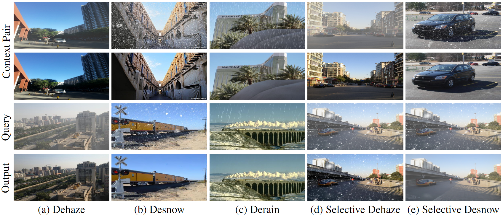
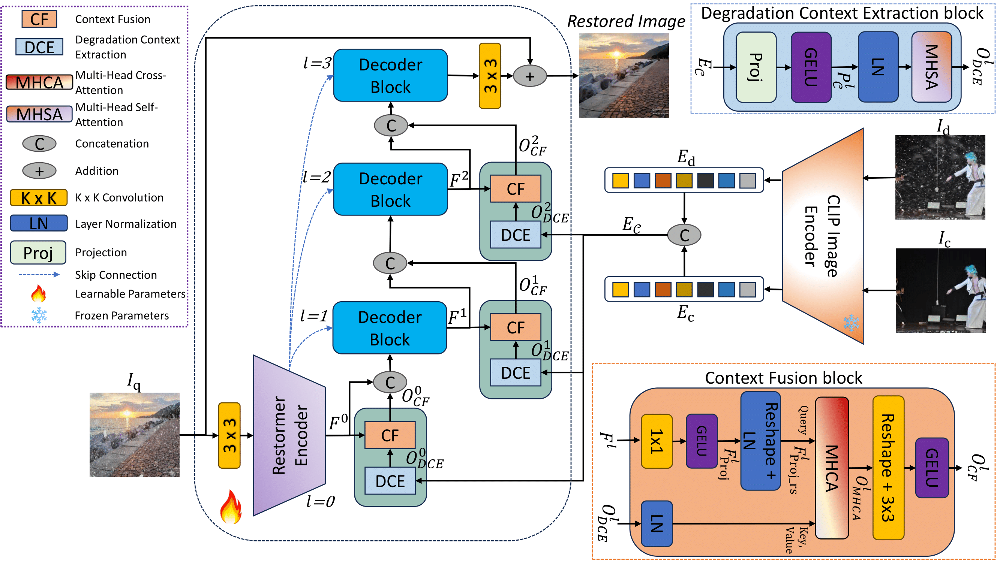

# [AAAI-2025] *AWRaCLe*: All-Weather Image Restoration using Visual In-Context Learning 

[Sudarshan rajagopalan](https://sudraj2002.github.io/) | [Vishal M. Patel](https://scholar.google.com/citations?user=AkEXTbIAAAAJ&hl=en)

[](https://sudraj2002.github.io/awraclepage/) [](https://arxiv.org/abs/2409.00263)


<div class="content has-text-justified">
<p>
Illustration of AWRaCLe: Our visual in-context learning approach for all-weather image restoration. Given a context pair (first two rows), AWRaCLe extracts 
relevant degradation context from it to restore a query image. Our method also performs selective removal of haze and snow from an image containing their mixture as shown in (d) and (e).
</p>
</div>
                        
<hr />

> **Abstract:** *All-Weather Image Restoration (AWIR) under adverse weather conditions is a challenging task due to the presence of different types of degradations. Prior research in this domain relies on extensive training data but lacks the utilization of additional contextual information for restoration guidance. Consequently, the performance of existing methods is limited by the degradation cues that are learnt from individual training samples. Recent advancements in visual in-context learning have introduced generalist models that are capable of addressing multiple computer vision tasks simultaneously by using the information present in the provided context as a prior. In this paper, we propose All-Weather Image Restoration using Visual In-Context Learning (AWRaCLe), a novel approach for AWIR that innovatively utilizes degradation-specific visual context information to steer the image restoration process. To achieve this, AWRaCLe incorporates Degradation Context Extraction (DCE) and Context Fusion (CF) to seamlessly integrate degradation-specific features from the context into an image restoration network. The proposed DCE and CF blocks leverage CLIP features and incorporate attention mechanisms to adeptly learn and fuse contextual information. These blocks are specifically designed for visual in-context learning under all-weather conditions and are crucial for effective context utilization. Through extensive experiments, we demonstrate the effectiveness of AWRaCLe for all-weather restoration and show that our method advances the state-of-the-art in AWIR.* 
<hr />

## Method

</img>
<p>
AWRaCLe integrates degradation-specific information from a context pair to facilitate the image restoration process. 
Initially, CLIP features are extracted from the context pair and fed into Degradation Context Extraction (DCE) blocks at various levels of the decoder within the image restoration network. 
The Context Fusion (CF) blocks then fuse the degradation information obtained from the DCE blocks with the decoder features of the query image requiring restoration. Finally, the restored image is generated.
</p>

## Installation

Clone the repository and create a new conda environment with Python=3.8. Install requirements.

```bash
git clone https://github.com/sudraj2002/AWRaCLe.git
cd awracle

conda create -n awracle python=3.8 -y
pip install -r requirements.txt
```

## Dataset and Checkpoint Download

Download the training and test data from [here](https://livejohnshopkins-my.sharepoint.com/:u:/g/personal/sambasa2_jh_edu/EYH5NpJv-lZFnBDRCAIpbgAB4juN0XihZBZgxaSz07kGrg?e=8NI6p1). Extract to ```<data_directory>```.
The dataset structure should look like
```
<data_directory>
└── data_awracle
    ├── CSD
    ├── Rain13K
    ├── RESIDE
    ├── Snow100k
    ├── Train
    └── Train_clip
```

Download the pre-trained model from [here](https://livejohnshopkins-my.sharepoint.com/:u:/g/personal/sambasa2_jh_edu/EWcypD6J7zRGgX0WKbP_G0QBzby9EzUCkcApoYkJJN4m4g?e=RRxP4E) and move it to the working directory.

## Quick Usage

### Training

To train the model from scratch on the datasets mentioned in the paper:

```
bash train.sh
```
Specify arguments ```--derain_dir, --dehaze_dir``` and ```desnow_dir``` as per your ```<data_directory>```. Additional arguments can be found in the ```options.py``` file.

### Testing

After training or when using a pre-trained model, run the test script:

```
bash test.sh
```
Make sure to modify the ```<data_directory>```.

## Custom Usage

For training and testing on custom data, see [custom](https://github.com/sudraj2002/AWRaCLe/blob/main/custom.md).

## Citation

If you find our work useful, please consider citing:

```bibtex
@article{rajagopalan2024awracle,
      title={AWRaCLe: All-Weather Image Restoration using Visual In-Context Learning}, 
      author={Sudarshan Rajagopalan and Vishal M. Patel},
      journal={arXiv preprint arXiv:2409.00263},
      year={2024}
}

```


### TODO
- [x] Inference Code
- [x] Pre-trained model release
- [x] Training Code
- [ ] Custom training and inference


